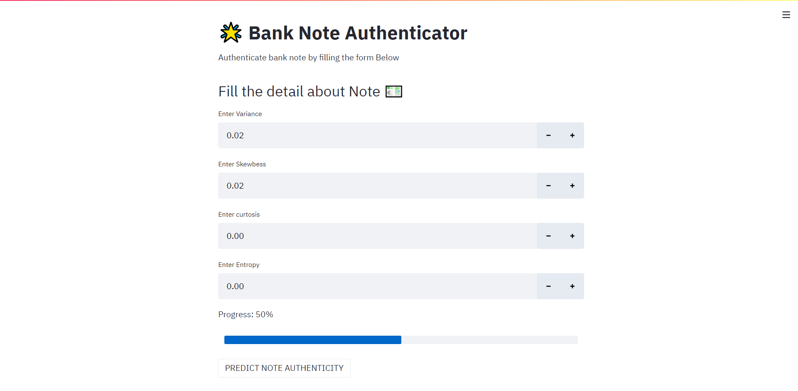
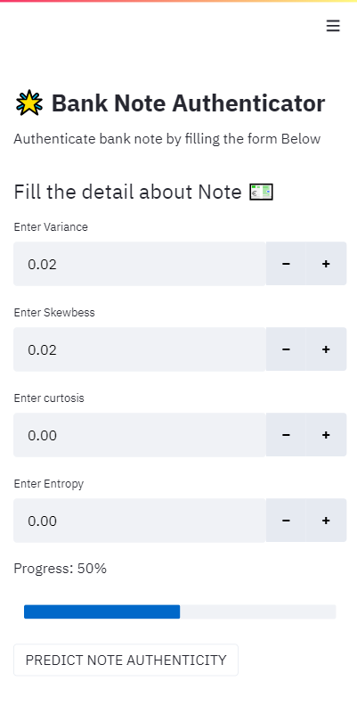
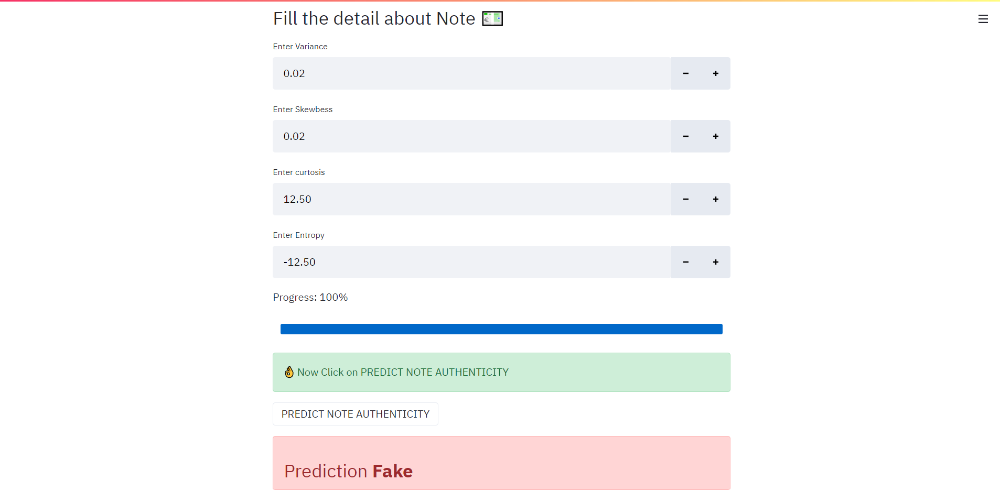
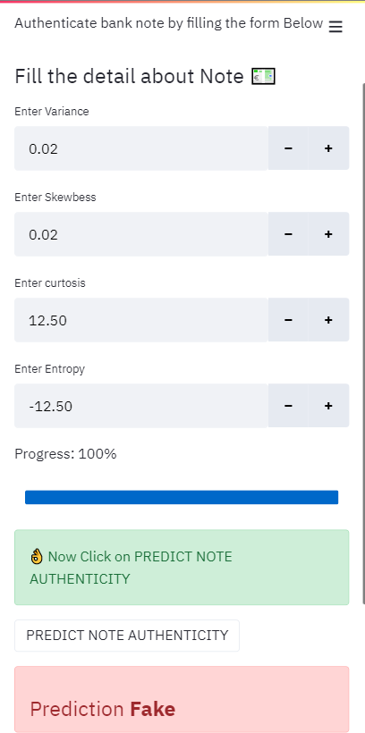

# 🌟 Bank Note Authenticator

Predicts weather a note is **fake** or **not** with **0.99** Accuracy

## 🚀 Preview
1. **Desktop Home**



2. **Mobile Home**



3. **Desktop Home Page**



4. **Mobile Home Page**




## 👩‍💻 Technologies Used

1. Streamlet
2. python
3. sklearn
4. xgboost
5. matplotlib
6. seaborn
7. pandas
8. numpy

## ⚙ How to Start

1. Install pipenv
```commandline
pip install pipenv
```
2. In Project directory execute following command
```commandline
pipenv install
```
3. Execute this command to start application
```commandline
streamlit run main.py
```
